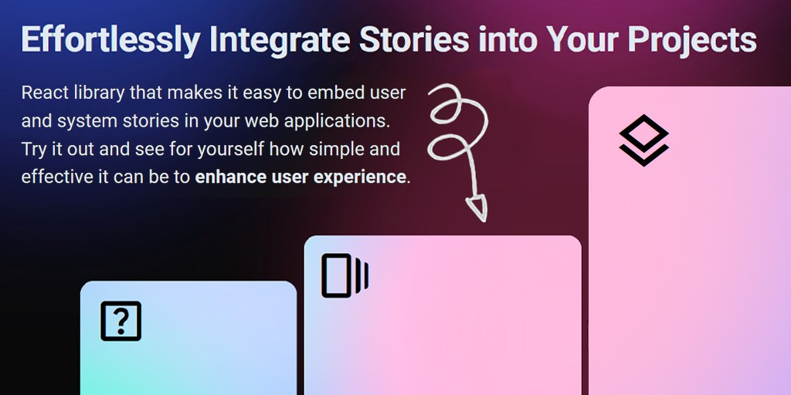

# React Stories Library

> The next generation of React Stories Library.



## Shared documentation

How to use it with the shared library can be found here: [Shared Development Readme](../../README.md#development)

## Features

- Zero dependency React library;
- Customizable Stories Content;
- Small library gzip-size;
- Fast implementation in exists React projects;
- Huge possibility of customization (External Components Integration, Presets).

## How to use

```bash
npm install @react-instastories/base
```

You can install all `react-instastories` libraries for fast setup:

```bash
npm install @react-instastories/base @react-instastories/external @react-instastories/presets
```

Import and create your first `InstaStories` component:

```tsx
// file.tsx
import {
  InstaStories,
  Page,
  Pages,
  Preview,
  Stories,
  Story
} from "@react-instastories/base";

import "@react-instastories/base/index.css";

export function AppStories() {
  return (
    <InstaStories>
      <Stories>
        <Story>
          <Preview>Preview Content For Story #1</Preview>
          <Pages>
            <Page>Page Content For Page #1 in Story #1</Page>
          </Pages>
        </Story>
      </Stories>
    </InstaStories>
  );
}
```

```tsx
// any-component.tsx
import { AppStories } from "../path/to/file";

// ... any place for render the component ...
<AppStories />;
```

### Additional libraries

- @react-instastories/external
- @react-instastories/presets

### How to use with oldest React?

> Some functions may stop working when using the library with older versions of `react`. Please note that the potentially minimum supported version of `react` and `react-dom` is **16.14.0**.

If you need to use this library with lower versions of `react`/`react-dom`, you can add the following parameter in your project's `package.json` file:

```json
"overrides": {
    "@react-instastories/base": {
      "react": "$react",
      "react-dom": "$react-dom",
    }
}
```

or specify the required version of the libraries instead of `$react` and `$react-dom` (for example, if you are not using these libraries directly)

```json
"overrides": {
    "@react-instastories/base": {
      "react": "~16.14.0",
      "react-dom": "~16.14.0",
    }
}
```

## Author

Maintained by [Dmitry Britov](https://github.com/kenclaron)
